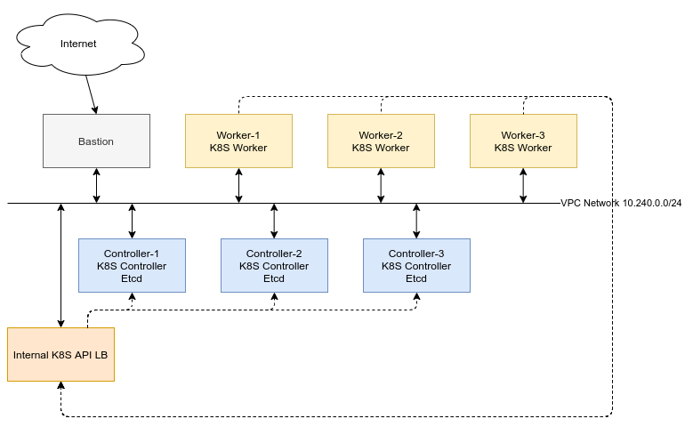

# kubeadm-gcp-experimental

Experimental to deploy k8s cluster on Google Cloud with etcdadm, kubeadm and calico

## Cluster Configuration

- Region: asia-southeast1-b

## Presequite

- Google Cloud Account
- Configured Google Cloud SDK cli
- Google Cloud Account SSH Key for Project Wide Scope with user `centos`:
  <https://cloud.google.com/compute/docs/instances/adding-removing-ssh-keys#project-wide>

## Cluster Component



## IP Address Planning

- Cluster Network: VPC `10.240.0.0/24`
- Internal K8S API LB: `10.240.0.6`
- Bastion: `10.240.0.2` + 1 Public IP
- K8S Masters: `10.240.0.11`, `10.240.0.12`, `10.240.0.13`
- K8S Workers: `10.240.0.21`, `10.240.0.22`, `10.240.0.23`
- K8S serviceSubnet: 192.168.128.0/17
- K8S podSubnet: 192.168.0.0/17

## Steps to setup

### Create Resources

Create VPC Network

```bash
gcloud compute networks create k8s-net --subnet-mode custom
gcloud compute networks subnets create k8s-subnet \
  --network k8s-net \
  --range 10.240.0.0/24

gcloud compute firewall-rules create k8s-allow-internal \
  --allow tcp,udp,icmp,ipip \
  --network k8s-net \
  --source-ranges 10.240.0.0/24
```

Allow vm to access internet: <https://cloud.google.com/solutions/building-internet-connectivity-for-private-vms>

Create bastion host `10.240.0.2`, add network tag and allow ssh from ssh to bastion host.

### Setup bastion host

- Install ansible
- Install git
- Clone this repo to bastion host

### Setup K8S API LB

Create firewall rule:

```bash
gcloud compute firewall-rules create fw-allow-health-check \
    --network=k8s-net \
    --action=allow \
    --direction=ingress \
    --source-ranges=130.211.0.0/22,35.191.0.0/16 \
    --rules=tcp,udp,icmp
```

Create health check

```bash
## for K8S API

gcloud compute health-checks create tcp hc-tcp-6443 \
    --region=asia-southeast1 \
    --port=6443
```

Create `k8s-master-group` instance group and add k8s-master-1 to this
instance group:

```bash
gcloud compute instance-groups unmanaged create k8s-master-group \
    --zone=asia-southeast1-b
gcloud compute instance-groups unmanaged add-instances k8s-master-group \
    --zone=asia-southeast1-b \
    --instances=k8s-controller-1
```

Create backend-service

```bash
gcloud compute backend-services create be-k8s-master-k8s-api \
    --load-balancing-scheme=internal \
    --protocol=tcp \
    --region=asia-southeast1 \
    --health-checks=hc-tcp-6443 \
    --health-checks-region=asia-southeast1
```

Add k8s master instance group to backend service

```bash
gcloud compute backend-services add-backend be-k8s-master-k8s-api \
    --region=asia-southeast1 \
    --instance-group=k8s-master-group \
    --instance-group-zone=asia-southeast1-b
```

Create forwading rulte to create LB

```bash
gcloud compute forwarding-rules create fr-ilb-k8s-api \
    --region=asia-southeast1 \
    --load-balancing-scheme=internal \
    --network=k8s-net \
    --subnet=k8s-subnet \
    --address=10.240.0.6 \
    --ip-protocol=TCP \
    --ports=6443 \
    --backend-service=be-k8s-master-k8s-api \
    --backend-service-region=asia-southeast1
```

### Setup K8S Masters

Create three K8S Master VMs: `10.240.0.11, 10.240.0.12, 10.240.0.13`

```bash
gcloud compute instances create k8s-controller-1 \
    --async \
    --boot-disk-size 40GB \
    --boot-disk-type pd-ssd \
    --can-ip-forward \
    --image-family centos-7 \
    --image-project centos-cloud \
    --machine-type e2-medium \
    --no-address \
    --private-network-ip 10.240.0.11 \
    --scopes compute-rw,storage-ro,service-management,service-control,logging-write,monitoring \
    --subnet k8s-subnet \
    --zone asia-southeast1-b \
    --tags k8s-cluster,controller,etcd

gcloud compute instances create k8s-controller-2 \
    --async \
    --boot-disk-size 40GB \
    --boot-disk-type pd-ssd \
    --can-ip-forward \
    --image-family centos-7 \
    --image-project centos-cloud \
    --machine-type e2-medium \
    --private-network-ip 10.240.0.12 \
    --no-address \
    --scopes compute-rw,storage-ro,service-management,service-control,logging-write,monitoring \
    --subnet k8s-subnet \
    --zone asia-southeast1-b \
    --tags k8s-cluster,controller,etcd

gcloud compute instances create k8s-controller-3 \
    --async \
    --boot-disk-size 40GB \
    --boot-disk-type pd-ssd \
    --can-ip-forward \
    --image-family centos-7 \
    --image-project centos-cloud \
    --machine-type e2-medium \
    --private-network-ip 10.240.0.13 \
    --no-address \
    --scopes compute-rw,storage-ro,service-management,service-control,logging-write,monitoring \
    --subnet k8s-subnet \
    --zone asia-southeast1-b \
    --tags k8s-cluster,controller,etcd
```

Setup docker and prepare presequite on 3 K8S Master VMs

```bash
ansible-playbook -i inventory.ini site.yml -e ansible_ssh_user=centos --key-file "/PATH_TO_GOOGLE_CLOUD_VM_KEY" --tags "ensure_k8s_presequite"
```

#### Setup etcd cluster

Init etcd cluster in `k8s-controller-1` by run following commands

```bash
# Run following command with root user
wget https://github.com/kubernetes-sigs/etcdadm/releases/download/v0.1.3/etcdadm-linux-amd64
mv etcdadm-linux-amd64 /usr/local/sbin/etcdadm
chmod +x  /usr/local/sbin/etcdadm
ETCDCTL_API=3 etcdadm init --version 3.4.13
```

Copy etcd certs from `k8s-controller-1` to `k8s-controller-2` and `k8s-controller-3`:

```bash
scp -i /PATH_TO_SSH_KEY /etc/etcd/pki/ca.* centos@10.240.0.12:/home/centos
scp -i /PATH_TO_SSH_KEY /etc/etcd/pki/ca.* centos@10.240.0.13:/home/centos
```

Join `k8s-controller-2` and `k8s-controller-3` to etcd cluster by run following commands
with root user on them:

```bash

mkdir -p /etc/etcd/pki/
mv /home/centos/ca* /etc/etcd/pki/

wget https://github.com/kubernetes-sigs/etcdadm/releases/download/v0.1.3/etcdadm-linux-amd64
mv etcdadm-linux-amd64 /usr/local/sbin/etcdadm
chmod +x  /usr/local/sbin/etcdadm

ETCDCTL_API=3 etcdadm join --version 3.4.13 https://10.240.0.11:2379
```

#### Setup k8s-controller-1 k8s controller components

use root user, create`kubeadm-config.yml` file with token is generated from command `kubeadm token generate`

Create config file `kubeadm-config.yml` on k8s-controller-1

Init k8s master:

```bash
kubeadm init --config kubeadm-config.yml
```

```setup kubectl conffig
mkdir -p $HOME/.kube
  sudo cp -i /etc/kubernetes/admin.conf $HOME/.kube/config
  sudo chown $(id -u):$(id -g) $HOME/.kube/config
```

Create `calico.yml` manifest file for calico CNI

Apply calico CNI:

```sh
kubectl apply -f calico.yml
```

Copy k8s master certificates to `k8s-controller-2` and `k8s-controller-3`:

```bash
scp  -i /PATH_TO_GOOGLE_CLOUD_VM_KEY /etc/kubernetes/pki/ca.crt centos@10.240.0.12:/home/centos
scp  -i /PATH_TO_GOOGLE_CLOUD_VM_KEY /etc/kubernetes/pki/ca.key centos@10.240.0.12:/home/centos
scp  -i /PATH_TO_GOOGLE_CLOUD_VM_KEY /etc/kubernetes/pki/sa.key centos@10.240.0.12:/home/centos
scp  -i /PATH_TO_GOOGLE_CLOUD_VM_KEY /etc/kubernetes/pki/sa.pub centos@10.240.0.12:/home/centos
scp  -i /PATH_TO_GOOGLE_CLOUD_VM_KEY /etc/kubernetes/pki/front-proxy-ca.crt centos@10.240.0.12:/home/centos
scp  -i /PATH_TO_GOOGLE_CLOUD_VM_KEY /etc/kubernetes/pki/front-proxy-ca.key centos@10.240.0.12:/home/centos

scp  -i /PATH_TO_GOOGLE_CLOUD_VM_KEY /etc/kubernetes/pki/ca.crt centos@10.240.0.13:/home/centos
scp  -i /PATH_TO_GOOGLE_CLOUD_VM_KEY /etc/kubernetes/pki/ca.key centos@10.240.0.13:/home/centos
scp  -i /PATH_TO_GOOGLE_CLOUD_VM_KEY /etc/kubernetes/pki/sa.key centos@10.240.0.13:/home/centos
scp  -i /PATH_TO_GOOGLE_CLOUD_VM_KEY /etc/kubernetes/pki/sa.pub centos@10.240.0.13:/home/centos
scp  -i /PATH_TO_GOOGLE_CLOUD_VM_KEY /etc/kubernetes/pki/front-proxy-ca.crt centos@10.240.0.13:/home/centos
scp  -i /PATH_TO_GOOGLE_CLOUD_VM_KEY /etc/kubernetes/pki/front-proxy-ca.key centos@10.240.0.13:/home/centos

```

#### Setup k8s-controller-2 and k8s-controller-3

```bash

USER=centos # customizable
mkdir -p /etc/kubernetes/pki/etcd
mv /home/${USER}/ca.crt /etc/kubernetes/pki/
mv /home/${USER}/ca.key /etc/kubernetes/pki/
mv /home/${USER}/sa.pub /etc/kubernetes/pki/
mv /home/${USER}/sa.key /etc/kubernetes/pki/
mv /home/${USER}/front-proxy-ca.crt /etc/kubernetes/pki/
mv /home/${USER}/front-proxy-ca.key /etc/kubernetes/pki/
```

Perform join k8s control plane:

```log
kubeadm join 10.240.0.6:6443 --token KUBE_CLUSTER_TOKEN --discovery-token-ca-cert-hash sha256:KUBE_CLUSTER_CA_CERT_HASH --control-plane
```

After join successful, add k8s-master-2 and k8s-master-3 to master
instance group:

```bash
gcloud compute instance-groups unmanaged add-instances k8s-master-group \
    --zone=asia-southeast1-b \
    --instances=k8s-controller-2,k8s-controller-3
```

### Setup K8S Workers

Create three K8S Master VMs: `10.240.0.21, 10.240.0.22, 10.240.0.23`

```bash
gcloud compute instances create k8s-worker-1 \
    --async \
    --boot-disk-size 40GB \
    --can-ip-forward \
    --image-family centos-7 \
    --image-project centos-cloud \
    --machine-type e2-medium \
    --no-address \
    --private-network-ip 10.240.0.21 \
    --scopes compute-rw,storage-ro,service-management,service-control,logging-write,monitoring \
    --subnet k8s-subnet \
    --zone asia-southeast1-b \
    --tags k8s-cluster,worker

gcloud compute instances create k8s-worker-2 \
    --async \
    --boot-disk-size 40GB \
    --can-ip-forward \
    --image-family centos-7 \
    --image-project centos-cloud \
    --machine-type e2-medium \
    --private-network-ip 10.240.0.22 \
    --no-address \
    --scopes compute-rw,storage-ro,service-management,service-control,logging-write,monitoring \
    --subnet k8s-subnet \
    --zone asia-southeast1-b \
    --tags k8s-cluster,worker

gcloud compute instances create k8s-worker-3 \
    --async \
    --boot-disk-size 40GB \
    --can-ip-forward \
    --image-family centos-7 \
    --image-project centos-cloud \
    --machine-type e2-medium \
    --private-network-ip 10.240.0.23 \
    --no-address \
    --scopes compute-rw,storage-ro,service-management,service-control,logging-write,monitoring \
    --subnet k8s-subnet \
    --zone asia-southeast1-b \
    --tags k8s-cluster,worker
```

Setup docker and prepare presequite on 3 K8S Master VMs

```bash
ansible-playbook -i inventory.ini site.yml -e ansible_ssh_user=centos --key-file "/PATH_TO_GOOGLE_CLOUD_VM_KEY" --tags "ensure_k8s_presequite"
```

Perform join k8s worker in each k8s-worker node by run this command with root user:

```log
kubeadm join 10.240.0.6:6443 --token KUBE_CLUSTER_TOKEN --discovery-token-ca-cert-hash sha256:KUBE_CLUSTER_CA_CERT_HASH
```

## References

- <https://cloud.google.com/compute/docs/instances/adding-removing-ssh-keys#project-wide>
- <https://docs.projectcalico.org/getting-started/kubernetes/self-managed-public-cloud/gce>
- <https://cloud.google.com/solutions/building-internet-connectivity-for-private-vms>
- <https://cloud.google.com/load-balancing/docs/internal/setting-up-internal>
- <https://github.com/kubernetes-sigs/etcdadm>
- <https://kubernetes.io/docs/setup/production-environment/tools/kubeadm/create-cluster-kubeadm/>
- <https://medium.com/faun/kubernetes-spin-up-highly-available-kubernetes-cluster-using-kubeadm-setup-cni-part-3-6af4f53aa735>
- <https://unofficial-kubernetes.readthedocs.io/en/latest/admin/kubeadm/>
- <https://www.devops.buzz/public/kubeadm/change-servicesubnet-cidr>
