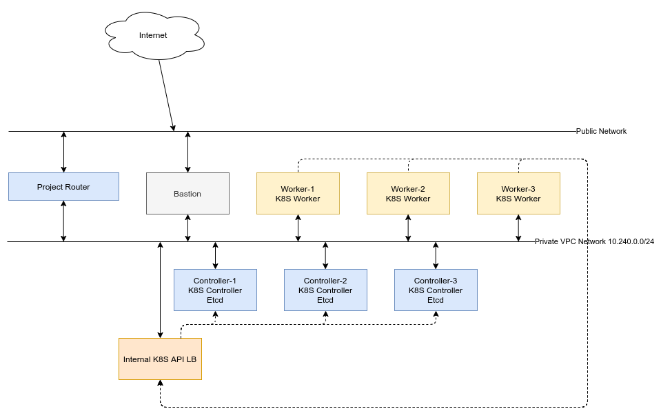

# kubeadm-gcp-experimental

Experimental to deploy k8s cluster on OpenStack Cloud Provider - VEXXHOST,
with etcdadm, kubeadm and calico

## Presequite

- Add Account SSH Key for Project Wide Scope with user `centos`

## Cluster Component



## IP Address Planning

- Private VPC Network: VPC `10.240.230.0/24`
- K8S serviceSubnet: 192.168.128.0/17
- K8S podSubnet: 192.168.0.0/17

## Steps to setup

### Create Resources

- Create Private VPC Network: "10.240.230.0/24"
- Create Router And attach Private VPC Network to Public Network
- Create bastion host, add network tag and allow ssh from ssh to bastion host.

### Setup bastion host

- Install ansible
- Install git
- Clone this repo to bastion host

### Create K8S Cluster Nodes

Create 3 K8S Master Nodes and 3 K8S Worker Nodes by GUI or CLI on OpenStack
Cloud, with following name:

```log
k8s-cls-1-master-1
k8s-cls-1-master-2
k8s-cls-1-master-3

k8s-cls-1-worker-1
k8s-cls-1-worker-2
k8s-cls-1-worker-3
```

After VMs are created, update ansible inventory file with IP of Created VMs

Setup docker and prepare presequite on K8S VMs. Run this
ansible playbook command on bastion node

```bash
ansible-playbook -i inventory.ini site.yml \
    -e ansible_ssh_user=centos --key-file "/path_to_vm_key" \
    --tags "ensure_k8s_presequite"
```

SSH to each node, ensure node hostname is the same with
OpenStack Instance Name by run command:

```bash
# On node k8s-cls-1-master-1
hostnamectl set-hostname k8s-cls-1-master-1
# On node k8s-cls-1-master-2
hostnamectl set-hostname k8s-cls-1-master-2
# On node k8s-cls-1-master-3
hostnamectl set-hostname k8s-cls-1-master-3

# On node k8s-cls-1-worker-1
hostnamectl set-hostname k8s-cls-1-worker-1
# On node k8s-cls-1-worker-2
hostnamectl set-hostname k8s-cls-1-worker-2
# On node k8s-cls-1-worker-3
hostnamectl set-hostname k8s-cls-1-worker-3

```

This setup is ensure openstack cloud controller manager can recognize k8s node
via OpenStack API.

### Setup firewall rules

Allow SSH Connection:

```bash
openstack security group rule create default \
      --ingress --protocol tcp --dst-port 22:22 --remote-ip 0.0.0.0/0

```

Allow connection between hosts in cluster, and from hosts in cluster to external network/internet

```bash

openstack security group rule create default \
      --ingress --protocol tcp --dst-port 1:65535 --remote-group default
openstack security group rule create default \
      --ingress --protocol udp --dst-port 1:65535 --remote-group default
openstack security group rule create default \
      --egress --protocol tcp --dst-port 1:65535 --remote-ip 0.0.0.0/0
openstack security group rule create default \
      --egress --protocol udp --dst-port 1:65535 --remote-ip 0.0.0.0/0

```

Allow connection from K8S Load Balancer to host etcd endpoint and host k8s-api endpoint

```bash
openstack security group rule create default \
      --ingress --protocol tcp --dst-port 2379:2379 --remote-ip 10.240.230.0/24
openstack security group rule create default \
      --ingress --protocol tcp --dst-port 6443:6443 --remote-ip 10.240.230.0/24
```

Allow IP-IP Protocol of Calico CNI:

```bash
openstack  security group rule create  --protocol 4  --egress  default
openstack  security group rule create  --protocol 4  --ingress  default
```

### Setup K8S API LB

Create LB

```bash
openstack loadbalancer create --name k8s-api-lb --vip-address 10.240.230.50
```

Create Listener

```bash
openstack loadbalancer listener create --protocol TCP --protocol-port 2379 --name k8s-etcd-listener  <LB_ID>
openstack loadbalancer listener create --protocol TCP --protocol-port 6443 --name k8s-api-listener  <LB_ID>
```

Create LB Pool and Pool Health Monitor

```bash
openstack loadbalancer pool create --name k8s-etcd-pool --listener <k8s-etcd-listener-id> --protocol TCP --lb-algorithm ROUND_ROBIN
openstack loadbalancer pool create --name k8s-api-pool --listener <k8s-api-listener-id> --protocol TCP --lb-algorithm ROUND_ROBIN
openstack loadbalancer healthmonitor create --delay 5 --max-retries 4 --timeout 10 --type TCP k8s-etcd-pool
openstack loadbalancer healthmonitor create --delay 5 --max-retries 4 --timeout 10 --type TCP k8s-api-pool
```

Create Pool Member

```bash
openstack loadbalancer member create \
    --name k8s-cls1-master-1 --weight 1 --address 10.240.230.K8S-MASTER-1-IP \
    --subnet-id <k8s_host_subnet_id> --protocol-port 2379 \
    k8s-etcd-pool

openstack loadbalancer member create \
    --name k8s-cls1-master-2 --weight 1 --address 10.240.230.K8S-MASTER-2-IP \
    --subnet-id <k8s_host_subnet_id> --protocol-port 2379 \
    k8s-etcd-pool

openstack loadbalancer member create \
    --name k8s-cls1-master-3 --weight 1 --address 10.240.230.K8S-MASTER-3-IP \
    --subnet-id <k8s_host_subnet_id> --protocol-port 2379 \
    k8s-etcd-pool


openstack loadbalancer member create \
    --name k8s-cls1-master-1 --weight 1 --address 10.240.230.K8S-MASTER-1-IP \
    --subnet-id <k8s_host_subnet_id> --protocol-port 6443 \
    k8s-api-pool

openstack loadbalancer member create \
    --name k8s-cls1-master-2 --weight 1 --address 10.240.230.K8S-MASTER-2-IP \
    --subnet-id <k8s_host_subnet_id> --protocol-port 6443 \
    k8s-api-pool

openstack loadbalancer member create \
    --name k8s-cls1-master-3 --weight 1 --address 10.240.230.K8S-MASTER-3-IP \
    --subnet-id <k8s_host_subnet_id> --protocol-port 6443 \
    k8s-api-pool
```

### Setup K8S Masters

#### Setup etcd cluster

Init etcd cluster in `k8s-controller-1` by run following commands

```bash
# Run following command with root user
wget https://github.com/kubernetes-sigs/etcdadm/releases/download/v0.1.3/etcdadm-linux-amd64
mv etcdadm-linux-amd64 /usr/local/sbin/etcdadm
chmod +x  /usr/local/sbin/etcdadm
ETCDCTL_API=3 etcdadm init --version 3.4.13
```

Copy etcd certs from `k8s-controller-1` to `k8s-controller-2` and `k8s-controller-3`:

```bash
scp -i /PATH_TO_SSH_KEY /etc/etcd/pki/ca.* centos@10.240.0.12:/home/centos
scp -i /PATH_TO_SSH_KEY /etc/etcd/pki/ca.* centos@10.240.0.13:/home/centos
```

Join `k8s-controller-2` and `k8s-controller-3` to etcd cluster by run following commands
with root user on them:

```bash

mkdir -p /etc/etcd/pki/
mv /home/centos/ca* /etc/etcd/pki/

wget https://github.com/kubernetes-sigs/etcdadm/releases/download/v0.1.3/etcdadm-linux-amd64
mv etcdadm-linux-amd64 /usr/local/sbin/etcdadm
chmod +x  /usr/local/sbin/etcdadm

ETCDCTL_API=3 etcdadm join --version 3.4.13 https://10.240.0.11:2379
```

#### Setup k8s-controller-1 k8s controller components

Create config file `kubeadm-config.yml` on k8s-controller-1 with sample from
`kubeadm-config-example.yml` file

Init k8s master:

```bash
kubeadm init --config kubeadm-config.yml
```

```setup kubectl conffig
mkdir -p $HOME/.kube
  sudo cp -i /etc/kubernetes/admin.conf $HOME/.kube/config
  sudo chown $(id -u):$(id -g) $HOME/.kube/config
```

Create cloud-config file from sample file `cloud.conf`
Create `cloud-config` secret in kubernetes secret:

```bash
kubectl create secret -n kube-system generic cloud-config --from-file=cloud.conf
```

Create RBAC resources and openstack-cloud-controller-manager deamonset

```bash
kubectl apply -f cloud-controller-manager-roles.yaml
kubectl apply -f cloud-controller-manager-role-bindings.yaml
kubectl apply -f openstack-cloud-controller-manager-ds.yaml
```

Create `calico.yml` manifest file for calico CNI

Apply calico CNI:

```sh
kubectl apply -f calico.yml
```

Copy k8s master certificates to `k8s-controller-2` and `k8s-controller-3`:

```bash
scp  -i /path_to_ssh_key_file /etc/kubernetes/pki/ca.crt centos@K8S_MASTER_2_IP:/home/centos
scp  -i /path_to_ssh_key_file /etc/kubernetes/pki/ca.key centos@K8S_MASTER_2_IP:/home/centos
scp  -i /path_to_ssh_key_file /etc/kubernetes/pki/sa.key centos@K8S_MASTER_2_IP:/home/centos
scp  -i /path_to_ssh_key_file /etc/kubernetes/pki/sa.pub centos@K8S_MASTER_2_IP:/home/centos
scp  -i /path_to_ssh_key_file /etc/kubernetes/pki/front-proxy-ca.crt centos@K8S_MASTER_2_IP:/home/centos
scp  -i /path_to_ssh_key_file /etc/kubernetes/pki/front-proxy-ca.key centos@K8S_MASTER_2_IP:/home/centos

scp  -i /path_to_ssh_key_file /etc/kubernetes/pki/ca.crt centos@K8S_MASTER_3_IP:/home/centos
scp  -i /path_to_ssh_key_file /etc/kubernetes/pki/ca.key centos@K8S_MASTER_3_IP:/home/centos
scp  -i /path_to_ssh_key_file /etc/kubernetes/pki/sa.key centos@K8S_MASTER_3_IP:/home/centos
scp  -i /path_to_ssh_key_file /etc/kubernetes/pki/sa.pub centos@K8S_MASTER_3_IP:/home/centos
scp  -i /path_to_ssh_key_file /etc/kubernetes/pki/front-proxy-ca.crt centos@K8S_MASTER_3_IP:/home/centos
scp  -i /path_to_ssh_key_file /etc/kubernetes/pki/front-proxy-ca.key centos@K8S_MASTER_3_IP:/home/centos
```

#### Setup k8s-controller-2 and k8s-controller-3

```bash
USER=centos # customizable
mkdir -p /etc/kubernetes/pki/etcd
mv /home/${USER}/ca.crt /etc/kubernetes/pki/
mv /home/${USER}/ca.key /etc/kubernetes/pki/
mv /home/${USER}/sa.pub /etc/kubernetes/pki/
mv /home/${USER}/sa.key /etc/kubernetes/pki/
mv /home/${USER}/front-proxy-ca.crt /etc/kubernetes/pki/
mv /home/${USER}/front-proxy-ca.key /etc/kubernetes/pki/
```

Perform join k8s control plane:

Create join config file with following sample format

```yaml
apiVersion: kubeadm.k8s.io/v1beta2
discovery:
  bootstrapToken:
    apiServerEndpoint: 10.240.230.50:6443
    token: JOIN_TOKEN
    caCertHashes: ["CA_CERT_HASH"]
kind: JoinConfiguration
nodeRegistration:
  kubeletExtraArgs:
    cloud-provider: "external"
controlPlane:
  localAPIEndpoint:
    advertiseAddress: K8S_MASTER_2_OR_3_IP_ADDRESS
```

Run join command

```bash
kubeadm join --config kubeadm-config.yml
```

### Setup K8S Workers

Perform join k8s worker in each k8s-worker node by run this command with root user:

```log
apiVersion: kubeadm.k8s.io/v1beta2
discovery:
  bootstrapToken:
    apiServerEndpoint: 10.240.230.50:6443
    token: JOIN_TOKEN
    caCertHashes: ["CA_CERT_HASH"]
kind: JoinConfiguration
nodeRegistration:
  kubeletExtraArgs:
    cloud-provider: "external"
```

Run join command

```bash
kubeadm join --config kubeadm-config.yml
```

### Setup cinder-csi-plugin

Apply cinder csi manifests (Rember don't recreate `cloud-config` secret)

```bash
kubectl -f cinder-csi-plugin/ apply
serviceaccount/csi-cinder-controller-sa created
clusterrole.rbac.authorization.k8s.io/csi-attacher-role created
clusterrolebinding.rbac.authorization.k8s.io/csi-attacher-binding created
clusterrole.rbac.authorization.k8s.io/csi-provisioner-role created
clusterrolebinding.rbac.authorization.k8s.io/csi-provisioner-binding created
clusterrole.rbac.authorization.k8s.io/csi-snapshotter-role created
clusterrolebinding.rbac.authorization.k8s.io/csi-snapshotter-binding created
clusterrole.rbac.authorization.k8s.io/csi-resizer-role created
clusterrolebinding.rbac.authorization.k8s.io/csi-resizer-binding created
role.rbac.authorization.k8s.io/external-resizer-cfg created
rolebinding.rbac.authorization.k8s.io/csi-resizer-role-cfg created
service/csi-cinder-controller-service created
statefulset.apps/csi-cinder-controllerplugin created
serviceaccount/csi-cinder-node-sa created
clusterrole.rbac.authorization.k8s.io/csi-nodeplugin-role created
clusterrolebinding.rbac.authorization.k8s.io/csi-nodeplugin-binding created
daemonset.apps/csi-cinder-nodeplugin created
csidriver.storage.k8s.io/cinder.csi.openstack.org created
```

Verify cinder csi pods are created:

```bash
kubectl get pods -n kube-system
NAME                                         READY   STATUS    RESTARTS   AGE
calico-kube-controllers-7d569d95-w7x6b       1/1     Running   0          13d
calico-node-2v7g6                            1/1     Running   0          13d
calico-node-6nx68                            1/1     Running   0          13d
calico-node-gdn7l                            1/1     Running   0          13d
calico-node-gtlfm                            1/1     Running   0          13d
calico-node-jhz6r                            1/1     Running   0          13d
calico-node-xrkkv                            1/1     Running   0          13d
coredns-f9fd979d6-5tg5h                      1/1     Running   0          13d
coredns-f9fd979d6-8d7hp                      1/1     Running   0          13d
csi-cinder-controllerplugin-0                5/5     Running   0          2m11s
csi-cinder-nodeplugin-4vczq                  2/2     Running   0          2m11s
csi-cinder-nodeplugin-6lldr                  2/2     Running   0          2m11s
csi-cinder-nodeplugin-l47wv                  2/2     Running   0          2m11s
csi-cinder-nodeplugin-mzq8f                  2/2     Running   0          2m11s
csi-cinder-nodeplugin-prz6r                  2/2     Running   0          2m11s
csi-cinder-nodeplugin-trwtm                  2/2     Running   0          2m11s
kube-apiserver-k8s-cls-1-master-1            1/1     Running   0          13d
kube-apiserver-k8s-cls-1-master-2            1/1     Running   0          13d
kube-apiserver-k8s-cls-1-master-3            1/1     Running   0          13d
kube-controller-manager-k8s-cls-1-master-1   1/1     Running   0          13d
kube-controller-manager-k8s-cls-1-master-2   1/1     Running   0          13d
kube-controller-manager-k8s-cls-1-master-3   1/1     Running   0          13d
kube-proxy-5b5fw                             1/1     Running   0          13d
kube-proxy-6cn69                             1/1     Running   0          13d
kube-proxy-8j67c                             1/1     Running   0          13d
kube-proxy-9qncw                             1/1     Running   0          13d
kube-proxy-dgt47                             1/1     Running   0          13d
kube-proxy-dlzm9                             1/1     Running   0          13d
kube-scheduler-k8s-cls-1-master-1            1/1     Running   0          13d
kube-scheduler-k8s-cls-1-master-2            1/1     Running   0          13d
kube-scheduler-k8s-cls-1-master-3            1/1     Running   0          13d
openstack-cloud-controller-manager-ghvrb     1/1     Running   0          13d
openstack-cloud-controller-manager-p6d74     1/1     Running   0          13d
openstack-cloud-controller-manager-w9276     1/1     Running   0          13d

kubectl get csidrivers.storage.k8s.io
NAME                       ATTACHREQUIRED   PODINFOONMOUNT   MODES                  AGE
cinder.csi.openstack.org   true             true             Persistent,Ephemeral   2m38s

```

## Verify Cluster Functionality After Setup Done

### Verify Cloud Load Balancer Service

Create a k8s nginx pod:

```yaml
# nginx.yaml file content

apiVersion: v1
kind: Pod
metadata:
  name: nginx
  labels:
   app: nginx
spec:
  containers:
  - name: nginx
    image: nginx:1.17.3-alpine
    ports:
    - containerPort: 80
```

```bash
kubectl apply -f nginx.yaml
```

Create a nginx LoadBalancer Service:

```yaml
# nginx-service.yaml file content
apiVersion: v1
kind: Service
metadata:
  name: nginxservice
  labels:
    app: nginx
spec:
  ports:
  - port: 80
    targetPort: 80
    protocol: TCP
  selector:
    app: nginx
  type: LoadBalancer
```

```bash
kubectl apply -f nginx-service.yaml
```

Verify K8S Service is created

```bash
kubectl get services
NAME           TYPE           CLUSTER-IP        EXTERNAL-IP    PORT(S)        AGE
kubernetes     ClusterIP      192.168.128.1     <none>         443/TCP        11h
nginxservice   LoadBalancer   192.168.213.173   38.108.68.29   80:32279/TCP   10m
```

Try access service:

```bash
curl -L http://38.108.68.29:80
<!DOCTYPE html>
<html>
<head>
<title>Welcome to nginx!</title>
<style>
    body {
        width: 35em;
        margin: 0 auto;
        font-family: Tahoma, Verdana, Arial, sans-serif;
    }
</style>
</head>
<body>
<h1>Welcome to nginx!</h1>
<p>If you see this page, the nginx web server is successfully installed and
working. Further configuration is required.</p>

<p>For online documentation and support please refer to
<a href="http://nginx.org/">nginx.org</a>.<br/>
Commercial support is available at
<a href="http://nginx.com/">nginx.com</a>.</p>

<p><em>Thank you for using nginx.</em></p>
</body>
</html>
```

### Verify Cloud Storage Service

Create Cinder Storage Class

```yaml
# file cinder-storage-class.yaml content
kind: StorageClass
apiVersion: storage.k8s.io/v1beta1
metadata:
  name: cinder-volume
provisioner: cinder.csi.openstack.org
reclaimPolicy: Delete
parameters:
  availability: nova
```

`kubectl apply -f cinder-storage-class.yaml`

Create cinder PVC

```yaml
# cinder-pvc.yaml file content
---
apiVersion: v1
kind: PersistentVolumeClaim
metadata:
  name: cinder-pvc
spec:
  accessModes:
    - ReadWriteOnce
  volumeMode: Filesystem
  resources:
    requests:
      storage: 50Mi
  storageClassName: cinder-volume
```

```bash
kubectl apply -f cinder-pvc.yaml
```

Create test volume pod

```yaml
# nginx-volume-pod.yaml file content
---
apiVersion: v1
kind: Pod
metadata:
  name: nginx-volume-pod
spec:
  containers:
    - name: nginx-volume-container-1
      image: nginx
      volumeMounts:
        - name: nginx-volume-1
          mountPath: /var/lib/www/html
  volumes:
    - name: nginx-volume-1
      persistentVolumeClaim:
        claimName: cinder-pvc
        readOnly: false

```

```bash
kubectl apply -f nginx-volume-pod.yaml
```

Verify created pod is working correctly

```bash
[root@k8s-cls-1-master-1 ~]# kubectl get pods -o wide
NAME               READY   STATUS    RESTARTS   AGE     IP               NODE                 NOMINATED NODE   READINESS GATES
nginx              1/1     Running   0          13d     192.168.67.193   k8s-cls-1-worker-2   <none>           <none>
nginx-volume-pod   1/1     Running   0          6m31s   192.168.95.1     k8s-cls-1-worker-1   <none>           <none>


kubectl exec -it  nginx-volume-pod -- /bin/bash
root@nginx-volume-pod:/# ls
bin  boot  dev	docker-entrypoint.d  docker-entrypoint.sh  etc	home  lib  lib64  media  mnt  opt  proc  root  run  sbin  srv  sys  tmp  usr  var
root@nginx-volume-pod:/# df -TH
Filesystem     Type     Size  Used Avail Use% Mounted on
overlay        overlay   54G  3.0G   51G   6% /
tmpfs          tmpfs     68M     0   68M   0% /dev
tmpfs          tmpfs    2.0G     0  2.0G   0% /sys/fs/cgroup
/dev/vda1      xfs       54G  3.0G   51G   6% /etc/hosts
shm            tmpfs     68M     0   68M   0% /dev/shm
/dev/vdb       ext4     1.1G  2.7M  1.1G   1% /var/lib/www/html
tmpfs          tmpfs    2.0G   13k  2.0G   1% /run/secrets/kubernetes.io/serviceaccount
tmpfs          tmpfs    2.0G     0  2.0G   0% /proc/acpi
tmpfs          tmpfs    2.0G     0  2.0G   0% /proc/scsi
tmpfs          tmpfs    2.0G     0  2.0G   0% /sys/firmware
root@nginx-volume-pod:/# vim
bash: vim: command not found
root@nginx-volume-pod:/# caty
bash: caty: command not found
root@nginx-volume-pod:/# ls -al /var/lib/www/html/
total 20
drwxr-xr-x. 3 root root  4096 Nov 29 09:34 .
drwxr-xr-x. 3 root root    18 Nov 29 09:34 ..
drwx------. 2 root root 16384 Nov 29 09:34 lost+found
cd /var/lib/www/html/

cat <<EOF >> test_file_1.txt
test file content in volume
EOF

cat /var/lib/www/html/test_file_1.txt
test file content in volume

openstack server list
+--------------------------------------+--------------------+--------+---------------------------------------------------+--------------------------+---------------+
| ID                                   | Name               | Status | Networks                                          | Image                    | Flavor        |
+--------------------------------------+--------------------+--------+---------------------------------------------------+--------------------------+---------------+
| 62d418af-d68c-44cb-85b4-0e087071832a | k8s-cls-1-worker-3 | ACTIVE | k8s-internal-network=10.240.230.xxx                | N/A (booted from volume) | v2-standard-1 |
| c0c4edc5-7675-471f-beac-933bb6c049a2 | k8s-cls-1-worker-2 | ACTIVE | k8s-internal-network=10.240.230.xxx               | N/A (booted from volume) | v2-standard-1 |
| e2ef6925-9858-4bbd-8f06-a9c304d9c57a | k8s-cls-1-worker-1 | ACTIVE | k8s-internal-network=10.240.230.xxx               | N/A (booted from volume) | v2-standard-1 |
| f85a4d8b-0116-44c2-ab98-a1ff61309f74 | bastion-host       | ACTIVE | k8s-internal-network=10.240.230.xxx, xxx | N/A (booted from volume) | v2-highcpu-1  |
| a1845df1-93d6-4805-a8cb-2394a1d33906 | k8s-cls-1-master-3 | ACTIVE | k8s-internal-network=10.240.230.xxx                | N/A (booted from volume) | v2-standard-2 |
| 77940124-fca8-45c9-a648-c9cef26539c8 | k8s-cls-1-master-2 | ACTIVE | k8s-internal-network=10.240.230.xxx                | N/A (booted from volume) | v2-standard-2 |
| bbc42dd9-8e67-49fe-b64e-19b17c1804a4 | k8s-cls-1-master-1 | ACTIVE | k8s-internal-network=10.240.230.xxx               | N/A (booted from volume) | v2-standard-2 |
+--------------------------------------+--------------------+--------+---------------------------------------------------+--------------------------+---------------+
openstack volume list
+--------------------------------------+------------------------------------------+--------+------+---------------------------------------------+
| ID                                   | Name                                     | Status | Size | Attached to                                 |
+--------------------------------------+------------------------------------------+--------+------+---------------------------------------------+
| e4dce28d-91a5-4536-92fc-0ee6c23f8f2e | pvc-51f5c922-9319-4687-b454-eeff0c8e303c | in-use |    1 | Attached to k8s-cls-1-worker-1 on /dev/vdb  |
| e3d41915-9249-4013-a7c8-94814237b122 | k8s-cls-1-worker-1-volume                | in-use |   50 | Attached to k8s-cls-1-worker-1 on /dev/vda  |
| 267da294-0f7b-432e-856c-1415ff859827 | k8s-cls-1-worker-3-volume                | in-use |   50 | Attached to k8s-cls-1-worker-3 on /dev/vda  |
| fce63408-64c8-413d-a657-b101203f9c6e |                                          | in-use |   10 | Attached to bastion-host on /dev/vda        |
| 6de6b888-57b3-4a39-bea4-47b338244941 | k8s-cls-1-worker-2-volume                | in-use |   50 | Attached to k8s-cls-1-worker-2 on /dev/vda  |
| bf8c6b75-3dee-4481-b504-a99a69ebd100 | k8s-cls-1-master-1-volume                | in-use |   50 | Attached to k8s-cls-1-master-1 on /dev/vda  |
| 9e54a9b0-cea1-497b-bc7d-11c57abac7fa | k8s-cls-1-master-2-volume                | in-use |   50 | Attached to k8s-cls-1-master-2 on /dev/vda  |
| 9df0d463-08b1-4436-9d8c-ce9d1ec8892a | k8s-cls-1-master-3-volume                | in-use |   50 | Attached to k8s-cls-1-master-3 on /dev/vda  |
+--------------------------------------+------------------------------------------+--------+------+---------------------------------------------+

kubectl drain k8s-cls-1-worker-1 --force --ignore-daemonsets
node/k8s-cls-1-worker-1 cordoned
WARNING: ignoring DaemonSet-managed Pods: kube-system/calico-node-6nx68, kube-system/csi-cinder-nodeplugin-l47wv, kube-system/kube-proxy-dgt47; deleting Pods not managed by ReplicationController, ReplicaSet, Job, DaemonSet or StatefulSet: default/nginx-volume-pod
evicting pod default/nginx-volume-pod
pod/nginx-volume-pod evicted
node/k8s-cls-1-worker-1 evicted

kubectl apply -f nginx-volume-pod.yaml
pod/nginx-volume-pod created

kubectl get pods -o wide
NAME               READY   STATUS    RESTARTS   AGE   IP               NODE                 NOMINATED NODE   READINESS GATES
nginx              1/1     Running   0          13d   192.168.67.193   k8s-cls-1-worker-2   <none>           <none>
nginx-volume-pod   1/1     Running   0          23s   192.168.67.194   k8s-cls-1-worker-2   <none>           <none>

kubectl exec -it  nginx-volume-pod -- /bin/bash

cat /var/lib/www/html/test_file_1.txt
test file content in volume

openstack volume list
+--------------------------------------+------------------------------------------+--------+------+---------------------------------------------+
| ID                                   | Name                                     | Status | Size | Attached to                                 |
+--------------------------------------+------------------------------------------+--------+------+---------------------------------------------+
| e4dce28d-91a5-4536-92fc-0ee6c23f8f2e | pvc-51f5c922-9319-4687-b454-eeff0c8e303c | in-use |    1 | Attached to k8s-cls-1-worker-2 on /dev/vdb  |
| 6de6b888-57b3-4a39-bea4-47b338244941 | k8s-cls-1-worker-2-volume                | in-use |   50 | Attached to k8s-cls-1-worker-2 on /dev/vda  |
| 267da294-0f7b-432e-856c-1415ff859827 | k8s-cls-1-worker-3-volume                | in-use |   50 | Attached to k8s-cls-1-worker-3 on /dev/vda  |
| fce63408-64c8-413d-a657-b101203f9c6e |                                          | in-use |   10 | Attached to bastion-host on /dev/vda        |
| e3d41915-9249-4013-a7c8-94814237b122 | k8s-cls-1-worker-1-volume                | in-use |   50 | Attached to k8s-cls-1-worker-1 on /dev/vda  |
| bf8c6b75-3dee-4481-b504-a99a69ebd100 | k8s-cls-1-master-1-volume                | in-use |   50 | Attached to k8s-cls-1-master-1 on /dev/vda  |
| 9e54a9b0-cea1-497b-bc7d-11c57abac7fa | k8s-cls-1-master-2-volume                | in-use |   50 | Attached to k8s-cls-1-master-2 on /dev/vda  |
| 9df0d463-08b1-4436-9d8c-ce9d1ec8892a | k8s-cls-1-master-3-volume                | in-use |   50 | Attached to k8s-cls-1-master-3 on /dev/vda  |
+--------------------------------------+------------------------------------------+--------+------+---------------------------------------------+

kubectl uncordon k8s-cls-1-worker-1
```

## References

- <https://github.com/kubernetes/cloud-provider-openstack/blob/master/docs/openstack-cloud-controller-manager/using-openstack-cloud-controller-manager.md>
- <https://github.com/kubernetes-sigs/etcdadm>
